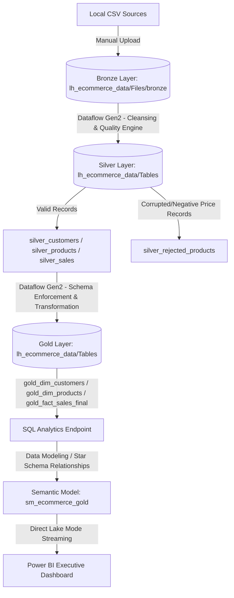

# Microsoft Fabric End-to-End Low-Code Medallion Pipeline

## 📌 Project Overview
This project demonstrates an enterprise-grade Data Engineering pipeline built entirely within **Microsoft Fabric** using a **Low-Code/No-Code** approach. 

The pipeline ingests raw transactional datasets, processes them through a multi-layer **Medallion Architecture (Bronze -> Silver -> Gold)**, enforces a **Hybrid Data Quality Framework**, shapes data into a relational **Star Schema**, and delivers sub-second operational analytics through **Power BI** using native **Direct Lake Mode** [://microsoft.com].

---

## 🏗️ Data Architecture Diagram

---

## 🛠️ Environment Setup & Infrastructure (Step-by-Step)

### 1. Dedicated Workspace Creation
- Logged into Microsoft Fabric (`://microsoft.com`).
- Navigated to **Workspaces** -> Clicked **+ New Workspace**.
- Named the workspace: `Fabric-Medallion-LowCode` and set the License Mode to *Fabric Capacity* or *Trial*.

### 2. Lakehouse Deployment
- Inside the workspace, clicked **+ New** -> Selected **Lakehouse**.
- Created the core centralized Lakehouse named: **`lh_ecommerce_data`**.
- This automatically generated two internal paths: `Files` (Unstructured/Raw data) and `Tables` (Managed Delta tables).

---

## 🔄 Detailed Step-by-Step Pipeline Implementation

### 🥉 Step 1: Bronze Layer (Raw Ingestion)
- Opened the **`lh_ecommerce_data`** Lakehouse.
- Right-clicked on **Files** -> Created a new folder named **`bronze`**.
- Uploaded the 3 dirty source files directly into the `Files/bronze/` path:
  - `customers.csv` (Duplicated IDs, white-spaces, and empty values).
  - `products.csv` (Contained corrupted text values and negative strings).
  - `sales.csv` (Transactional orders fact logs).

### 🥈 Step 2: Silver Layer (Data Cleansing & Error Logging via Dataflow Gen2)
- Clicked **+ New** -> Selected **Dataflow Gen2** -> Renamed it to **`df_silver_cleansing`**.
- Clicked **Get Data** -> **Lakehouse** -> Connected to `lh_ecommerce_data` -> Selected the 3 CSV files from the `Files/bronze` path.

#### 🧼 Detailed Cleaning Transformations Applied:
1. **`customers` Query:**
   - Switched from **Schema View** to **Data View** via the *View* menu tab to expose rows.
   - Clicked **Use first row as headers** to fix column layouts.
   - Right-clicked `CustomerID` -> Selected **Remove Duplicates** to eliminate redundant tracking.
   - Right-clicked `CustomerName` -> Selected **Transform** -> **Trim** to clear dead spaces.
   - Fixed a bug where empty records (`,,`) bypassed the `null` replacement rule: Right-clicked `CustomerName` -> **Replace Values** -> Left *Value to find* completely blank, set *Replace with* to **`Unknown`**.
   - Right-clicked `Email` -> Selected **Transform** -> **Lower Case** for text standardization.

2. **`products` Query (The Hybrid Quality & Reject Table Strategy):**
   - Clicked `Price` datatype icon -> Converted to **Decimal Number**. Alphanumeric corrupted data shifted to an internal `Error` state.
   - **Production Guard:** Right-clicked `Price` -> Selected **Replace Errors** -> Mapped corrupt inputs to a constant flag of **`-99`**.
   - Clicked **Add Column** -> Selected **Conditional Column** -> Named it `Data_Quality_Status`. Rule: *If Price <= 0, then 'Bad Record', Else 'Valid'*.
   - Right-clicked the query -> Selected **Duplicate** -> Renamed this split target to **`silver_rejected_products`**.
   - **Isolating Bad Rows:** Inside `silver_rejected_products`, filtered `Data_Quality_Status` to retain **ONLY** `'Bad Record'`.
   - **Isolating Clean Rows:** Inside the original query, filtered `Data_Quality_Status` to retain **ONLY** `'Valid'`.

3. **`sales` Query:**
   - Converted `OrderDate` column datatype to an explicit **Date** format.

#### 🎯 Mapping Silver Outputs to Lakehouse Targets:
- Selected `customers` -> Clicked **+ Data destination** (Bottom-Right) -> Selected **Lakehouse** -> Selected `lh_ecommerce_data` -> Selected the **`dbo`** container -> Named the table **`silver_customers`**. Enforced default **Replace** behavior via *Use automatic settings*.
- Followed the exact same sequence to map the remaining pipelines into the `dbo` schema:
  - Cleaned products went to **`silver_products`**.
  - Corrupted logs went to **`silver_rejected_products`**.
  - Transactions went to **`silver_sales`**.
- Clicked **Save & Run** (Top-Left) to publish and execute the Spark compute backend.

---

### 🥇 Step 3: Gold Layer (Analytical Modeling via Query Referencing)
- Clicked **+ New** -> Selected **Dataflow Gen2** -> Renamed to **`df_gold_starschema`**.
- Clicked **Get Data** -> **Lakehouse** -> Opened the **`Tables`** folder -> Imported `silver_customers`, `silver_products`, and `silver_sales`.

#### 🔗 Zero-Copy Query Referencing:
To maintain elite production performance without creating copy footprints, we used query **Referencing** instead of a standard duplicate merge:
- Right-clicked `silver_customers` -> Selected **Reference** -> Renamed to **`gold_dim_customers`**.
- Right-clicked `silver_products` -> Selected **Reference** -> Renamed to **`gold_dim_products`**.
- Right-clicked `silver_sales` -> Selected **Reference** -> Renamed to **`gold_fact_sales`**.

#### ⚙️ Feature Engineering & Fixing Cache Desynchronization Locks:
- Selected `gold_fact_sales` -> Clicked **Add Column** -> **Custom Column**. Named it `TotalRevenue`. Formula: **`[Quantity] * [UnitPrice]`**.
- **The Schema Lock Bug:** Saving this initially threw a Delta constraint error because the column defaulted to an unmappable `Any` type, blocking the `Next` progression.
- **The Resolution:** Clicked the `ABC/123` type icon on the new column and explicitly cast it to **`Decimal Number`**. To break OneLake's internal *Schema Cache lock*, wiped out the old mapping target, clicked **+ Data destination** -> **Lakehouse** -> **`dbo`** -> and generated a completely clean target name: **`gold_fact_sales_final`**.
- Mapped all 3 queries to their respective `gold_` names inside the `dbo` schema and triggered **Save & Run**.

---

## 📊 Step 4: Semantic Modeling & Power BI Integration

### 1. Relational Modeling
- Navigated to the `lh_ecommerce_data` Workspace dashboard -> Clicked the `lh_ecommerce_data` Lakehouse item.
- Clicked **+ New semantic model** on the top menu options.
- Named the model **`sm_ecommerce_gold`** and selected **ONLY** our 3 refined gold tables (`gold_dim_customers`, `gold_dim_products`, `gold_fact_sales_final`) from the checkbox menu -> Clicked **Confirm**.
- In the Model view canvas, generated strong star schema bounds via drag-and-drop:
  - Linked `gold_dim_customers(CustomerID)` to `gold_fact_sales_final(CustomerID)` -> **1:Many (*:1)**.
  - Linked `gold_dim_products(ProductID)` to `gold_fact_sales_final(ProductID)` -> **1:Many (*:1)**.

### 2. Building the Executive Dashboard
- Clicked **New report** from the top ribbon layout inside the modeling interface.
- **Visual 1 (KPI Tracker):** Selected the **Card** visual icon from the Visualizations panel. Opened `gold_fact_sales_final` in the Data pane and checked **`TotalRevenue`** to render the aggregated enterprise scale.
- **Visual 2 (Regional Bar Chart):** Selected the **Clustered bar chart** icon. Dragged `Country` from `gold_dim_customers` into the **Y-axis** box, and `TotalRevenue` from `gold_fact_sales_final` into the **X-axis** box.
- **Visual 3 (Category Donut Chart):** Selected the **Donut chart** icon. Dragged `Category` from `gold_dim_products` into the **Legend** box, and `Quantity` from `gold_fact_sales_final` into the **Values** box.
- Clicked **File** -> **Save** -> Saved the production report as **`Executive_Sales_Dashboard`**.
