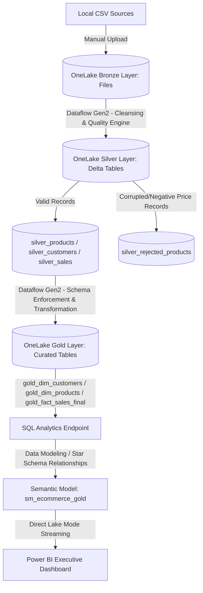

# microsoft-fabric-lowcode-medallion-pipeline
End-to-End Enterprise Data Platform on Microsoft Fabric using Dataflow Gen2, Medallion Architecture, Hybrid Data Quality Framework, and Power BI Direct Lake Mode.
# Enterprise Data Platform & Medallion Pipeline via Microsoft Fabric

## 📌 Project Overview
This repository showcases an end-to-end, enterprise-grade Data Engineering platform built entirely within **Microsoft Fabric** using a **Low-Code/No-Code** implementation. 

The pipeline ingests raw transactional datasets, processes them through a multi-layer **Medallion Architecture (Bronze -> Silver -> Gold)** utilizing **Dataflow Gen2 (Power Query Online Engine powered by Spark Compute)**, enforces an advanced **Hybrid Data Quality Framework**, shapes data into a relational **Star Schema**, and delivers operational analytics through **Power BI** using native **Direct Lake Mode** [://microsoft.com].

---

## 🏗️ Data Architecture Diagram


---

## 🛠️ Tech Stack & Fabric Core Components
- **Orchestration & Storage:** Azure OneLake (SaaS Multi-cloud Data Lake)
- **Data Ingestion Engine:** OneLake File Storage (Bronze Landing Zone)
- **Data Transformation Engine:** Dataflow Gen2 (Power Query Engine backend by Spark Compute)
- **Storage Format:** Highly optimized **Delta Lake Format (Parquet + Transaction Logs)** with native V-Order tuning enabled.
- **Semantic Layer & Modeling:** SQL Analytics Endpoint & Power BI Dataset Modeler
- **Business Intelligence:** Power BI Desktop/Service (Direct Lake Connectivity)

---

## 🔄 Layer-by-Layer Technical Implementation

### 🥉 1. Bronze Layer (Raw Landing)
- **Objective:** Immutable landing zone where raw operational source files (`customers.csv`, `products.csv`, `sales.csv`) are safely stored without modifications.
- **Data Condition:** Messy schema, duplicated keys, lower/uppercase inconsistencies, missing customer fields, negative pricing strings, and mixed datatypes.

### 🥈 2. Silver Layer (Enterprise Cleansing & Hybrid Quality Framework)
- **Objective:** Cleanse, enrich, and segregate master/transactional schemas.
- **Transformations Applied:**
  - **Deduplication:** Applied explicit entity resolution on `CustomerID` via duplicate removal constraints.
  - **Text Standardization:** Executed `.Trim()` metrics on `CustomerName` to purge whitespace corruption and converted `Email` fields to lowercase.
  - **Handling Blanks:** Fixed a common Power Query issue where empty values (`,,`) were interpreted as spaces instead of `null` by implementing explicit blank-string replacement logic to capture `'Unknown'`.

---

## ⚙️ Production Debugging Log & Error Handling (Crucial Fixes)

During development, the pipeline was enhanced with strict production safeguards to handle real-world dirty data. Below are the major architectural bugs encountered and engineered fixes applied:

### Bug 1: Handling Alphanumeric Values in Numeric Fields (`text_error` & Negative Prices)
* **Problem:** The raw `Price` column contained an explicit string entry (`text_error`) and negative data values (`-500` for Running Shoes). Direct conversion to numeric format caused query breaks or skewed calculations.
* **Production Fix (The Hybrid Strategy):** 
  - Instead of dropping data or breaking the pipeline, a **`Replace Errors`** boundary was created by mapping string corruptions to a dummy constant flag of **`-99`**.
  - Engineered a **Conditional Column** (`Data_Quality_Status`) with a logic splitter: If `Price <= 0`, flag as `Bad Record`, else `Valid`.
  - Created a completely segregated **`silver_rejected_products`** audit table holding only `Bad Record` data for compliance audits, while routing clean records cleanly to `silver_products`.

### Bug 2: Schema Cache Desynchronization during Fact Table Expansion
* **Problem:** Adding a computed column (`TotalRevenue`) in the Gold layer triggered a caching conflict in OneLake's backend Schema Cache during an `Existing Table` overwrite. The Data destination મ್ಯಾపింగ్ window threw an error: *"Column cannot be included because it is of type Any"* and blocked the `Next` progression.
* **Production Fix:** 
  1. Isolated the newly engineered column and explicitly cast its type from `Any` to **`Decimal Number`** at the step level to satisfy Delta storage contract rules.
  2. Overcame the target table lock by dropping the legacy destination footprint (`Reset Mapping`) and defining a completely clean semantic target name (**`gold_fact_sales_final`**), resetting OneLake's internal metadata map.

---

### 🥇 3. Gold Layer (Business Semantics & Star Schema)
- **Objective:** Model refined Silver data into highly performant analytical Star Schema layers without duplicating storage footprints via query **Referencing**.
- **Dimensions Engineered:**
  - `gold_dim_customers` (CustomerID, CustomerName, Email, Country)
  - `gold_dim_products` (ProductID, ProductName, Category, Price)
- **Fact Table & Feature Engineering:**
  - Engineered `gold_fact_sales_final` containing primary metrics, foreign keys, and a new custom calculated column: `TotalRevenue = [Quantity] * [UnitPrice]` explicitly mapped to a tight Decimal datatype.

---

## 📊 Semantic Modeling & BI Layer (Direct Lake Architecture)
- Transitioned into the **SQL Analytics Endpoint** and switched to **Model View** to architect relational entity integrity.
- Established strict `1:Many (1:*)` bidirectional star schema links from Dimension primary keys to Fact foreign keys.
- Leveraged **Direct Lake Mode** inside Power BI [://microsoft.com]. This allows the report to stream calculations directly against the physical Delta Parquet files in OneLake without copying data into memory (Import Mode) or querying slow databases (Direct Query).

### 📈 Executive Insights Delivered:
- **Total Enterprise Revenue:** High-level executive card matrix tracker.
- **Revenue Distribution by Geography:** Clustered bar visual detailing top performing international clusters.
- **Sales Volume Breakdown:** Donut visual analyzing product category performance logs (`Quantity by Category`).

---

## 📁 Repository Structure
```text
├── data_sample/               <- Raw Dirty CSV Source Files
│   ├── customers.csv
│   ├── products.csv
│   └── sales.csv
├── screenshots/               <- Production Verification Artifacts
│   ├── 01_silver.png          <- Cleansing & Error Replacement Layer
│   ├── 02_gold.png            <- Feature Engineering & Referencing 
│   ├── 03_model.png           <- Star Schema Model Architecture View
│   └── 04_dashboard.png       <- Final Power BI Executive Dashboard View
└── README.md                  <- Main Technical Documentation
```
